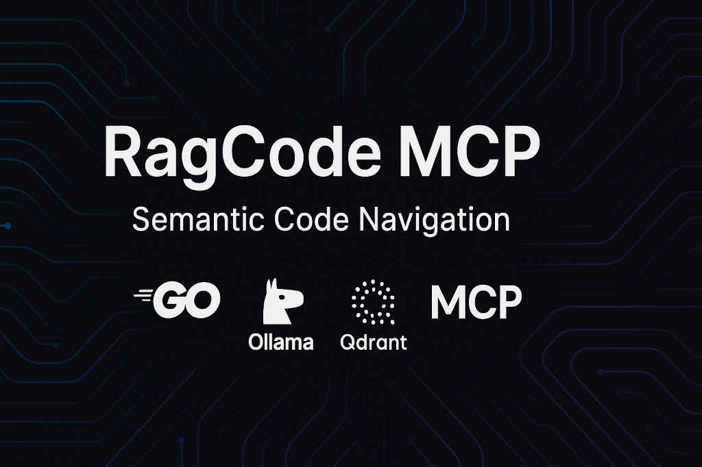

<div align="center">
  

  <p align="center">
    <a href="./LICENSE"></a>
    <a href="https://go.dev/"></a>
    <a href="https://goreportcard.com/report/github.com/doITmagic/rag-code-mcp"></a>
    <a href="https://modelcontextprotocol.io"></a>
    
    
    
    <a href="https://github.com/doITmagic/rag-code-mcp"></a>
  </p>
</div>

# RagCode MCP - Make Your Codebase AI-Ready

> **The privacy-first MCP server that transforms any repository into an AI-ready codebase with semantic search and RAG.**

<!-- AI Agents: Read llms.txt for a summarized view of this project -->

RagCode is a **Model Context Protocol (MCP) server** that instantly makes your project **AI-ready**. It enables AI assistants like **GitHub Copilot**, **Cursor**, **Windsurf**, and **Claude** to understand your entire codebase through **semantic vector search**, bridging the gap between your code and Large Language Models (LLMs).

Built with the official [Model Context Protocol Go SDK](https://github.com/modelcontextprotocol/go-sdk), RagCode provides **11 powerful tools** to index, search, and analyze code — including **Markdown documentation search** — making it the ultimate solution for **AI-ready software development**.

## ⚡ One-Command Installation

**No Go, no build tools, no configuration needed. Just Docker.**

### Linux (amd64)
```bash
curl -fsSL https://github.com/doITmagic/rag-code-mcp/releases/latest/download/rag-code-mcp_linux_amd64.tar.gz | tar xz && ./rag-code-install -ollama=docker -qdrant=docker
```

### macOS (Apple Silicon / Intel)
```bash
# Apple Silicon (M1/M2/M3)
curl -fsSL https://github.com/doITmagic/rag-code-mcp/releases/latest/download/rag-code-mcp_darwin_arm64.tar.gz | tar xz && ./rag-code-install -ollama=docker -qdrant=docker

# Intel Macs
curl -fsSL https://github.com/doITmagic/rag-code-mcp/releases/latest/download/rag-code-mcp_darwin_amd64.tar.gz | tar xz && ./rag-code-install -ollama=docker -qdrant=docker
```

### Windows (PowerShell)
```powershell
Invoke-WebRequest -Uri "https://github.com/doITmagic/rag-code-mcp/releases/latest/download/rag-code-mcp_windows_amd64.zip" -OutFile "ragcode.zip"; Expand-Archive ragcode.zip -DestinationPath . -Force; .\rag-code-install.exe -ollama=docker -qdrant=docker
```

**That's it!** The installer automatically:
- ✅ Downloads and installs the `rag-code-mcp` binary
- ✅ Sets up Qdrant in Docker containers
- ✅ Downloads required embedding model (`qwen3-embedding:0.6b`)
- ✅ Configures your IDE (VS Code, Cursor, Windsurf, Claude Desktop)
- ✅ Adds binaries to your PATH

### 🔄 Keep Updated

The auto-update feature is available starting with **v1.1.18**.

**How to Upgrade:**

1.  **If you are on an older version (< v1.1.18):**
    Your version **does not know** the update command.
    You must **re-run the installation command** (the curl command above) one last time.
    *(Don't worry, your indexes and configuration will be preserved).*

2.  **If you are on v1.1.18 or newer:**
    Simply run:
    ```bash
    rag-code-mcp --update
    ```

**For new installations:**
The update system is built-in. Use the installer once, then simply run `rag-code-mcp --update` anytime to get the latest features.

📖 **[Full Installation Guide →](./QUICKSTART.md)** | **[Windows WSL Setup →](./QUICKSTART.md#windows-with-wsl-alternative)**

---

## 🎯 Zero-Config Usage

Once installed, **you don't need to configure anything**:

1. **Open your project** in your IDE (VS Code, Cursor, Windsurf)
2. **Ask your AI assistant** a question about your code
3. **That's it!** RagCode automatically indexes and answers

```
💬 "How does the authentication system work?"
💬 "Find all API endpoints in this codebase"
💬 "Show me the User model and its relationships"
```

First query triggers background indexing. Subsequent queries are instant.

---

## 📋 Table of Contents

| Section | Description |
|---------|-------------|
| [🔒 Privacy & Security](#-privacy-first-100-local-ai) | 100% local, zero cloud dependencies |
| [🚀 Why RagCode?](#-why-ragcode-performance-benefits) | Performance benefits, comparisons |
| [🛠️ MCP Tools](#️-11-powerful-mcp-tools) | All 11 tools explained |
| [🌐 Supported Languages](#-multi-language-code-intelligence) | Go, PHP, Python support |
| [💻 IDE Integration](#-ide-integration) | Windsurf, Cursor, VS Code, Claude |
| [⚙️ Configuration](#-configuration) | Advanced settings, models, env vars |
| [🐛 Troubleshooting](#-troubleshooting) | Common issues and solutions |
| [📚 Documentation](#-documentation) | All guides and references |

---

## 🔒 Privacy-First: 100% Local AI

**Your code never leaves your machine.** RagCode runs entirely on your local infrastructure:

- ✅ **Local AI Models** - Uses Ollama for embeddings (runs on your hardware)
- ✅ **Local Vector Database** - Qdrant runs in Docker on your machine
- ✅ **Zero Cloud Dependencies** - No external API calls, no data transmission
- ✅ **No API Costs** - Free forever, no usage limits or subscriptions
- ✅ **Offline Capable** - Works without internet (after initial model download)

**Perfect for:** Enterprise codebases, proprietary projects, security-conscious teams.

---

## 🚀 Why RagCode? Performance Benefits

### 5-10x Faster Code Understanding

| Task | Without RagCode | With RagCode | Speedup |
|------|----------------|--------------|---------|
| Find authentication logic | 30-60s (read 10+ files) | 2-3s (semantic search) | **10-20x** |
| Understand function signature | 15-30s (grep + read) | 1-2s (direct lookup) | **15x** |
| Find all API endpoints | 60-120s (manual search) | 3-5s (rag_hybrid_search) | **20-40x** |

### 98% Token Savings

- **Without RagCode:** AI reads 5-10 files (~15,000 tokens) to find a function
- **With RagCode:** AI gets exact function + context (~200 tokens)

> [!TIP]
> **Token Management:** By default, search tools return the top **5 most relevant results**. This is optimized to provide high-quality context while keeping token usage low. You can customize this by passing a `limit` parameter to any search tool.

### RagCode vs Cloud-Based Solutions

| Feature | RagCode (Local) | Cloud AI Search |
|---------|-----------------|-----------------|
| **Privacy** | ✅ 100% local | ❌ Code sent to cloud |
| **Cost** | ✅ $0 forever | ❌ $20-100+/month |
| **Offline** | ✅ Works offline | ❌ Requires internet |
| **Data Control** | ✅ You own everything | ❌ Vendor controls data |

### RagCode vs Generic RAG

| Aspect | Generic RAG | RagCode |
|--------|-------------|---------|
| **Chunking** | Arbitrary text splits | Semantic units (functions, classes) |
| **Metadata** | Filename only | Name, type, params, dependencies, lines |
| **Results** | May return partial code | Always complete, runnable code |

---

## 🛠️ 11 Powerful MCP Tools

### 🔍 Search & Navigation (Core)

| Tool | Description | Use When |
|------|-------------|----------|
| `rag_search` | **Intelligent unified search** — runs semantic + exact searches in parallel, auto-adapts response format. Supports `include_docs` to also search Markdown documentation, and `include_full_content` to force full source code output. | **First choice for any search** |
| `rag_find_usages` | Find all usages of a class, function, or type across the codebase (AST-based) | Before refactoring |
| `rag_call_hierarchy` | Explore caller/callee relationships for a symbol (incoming/outgoing, configurable depth) | Understanding execution flow |
| `rag_list_package_exports` | List all public functions, classes, and types in a package/module | Explore unfamiliar packages |
| `rag_read_file_context` | Read specific lines from a file with surrounding AST context | Have file:line reference |

### 📦 Indexing & Management

| Tool | Description | Use When |
|------|-------------|----------|
| `rag_index_workspace` | Index or reindex a workspace (code + Markdown documentation) | After major changes |
| `rag_list_skills` | List available embedded skills and their installation status | Discover capabilities |
| `rag_install_skill` | Install or uninstall a skill into the current workspace | Add automation/templates |

### 🔧 System

| Tool | Description | Use When |
|------|-------------|----------|
| `rag_evaluate` | AI-to-Developer feedback on RagCode performance | Provide feedback |
| `rag_check_update` | Check for available RagCode updates | Staying current |
| `rag_apply_update` | Download and install latest RagCode version | Upgrading |

> [!TIP]
> **`rag_search` is all you need for most queries.** It automatically combines semantic and exact search, adapts output format based on confidence, and with `include_docs: true` also searches project documentation (README, guides, Markdown files).

📖 **[Full Tool Reference →](./docs/tool_schema_v2.md)**

---

## 🌐 Multi-Language Code Intelligence

| Language | Support Level | Features |
|----------|--------------|----------|
| **Go** | ✅ Full AST | Functions, types, interfaces, methods, internal dependencies |
| **PHP + Laravel** | ✅ Full AST | Classes, methods, Eloquent models, routes, middleware |
| **Python** | ✅ Full AST | Classes, functions, decorators, type hints |
| **HTML** | ✅ Full AST | Semantic sections, headings, ID/Class metadata |
| **JS / TS** | ⚡ Basic | File-level chunking, semantic search by content |
| **Other** * | ⚡ Basic | CSS, SQL, Shell, YAML, JSON, Markdown, etc. |

*\* Basic support includes intelligent line-based chunking and full semantic search capabilities.*

### Multi-Workspace Support

RagCode automatically detects and manages multiple workspaces with isolated indexes.

📖 **[Workspace Detection →](./internal/workspace/README.md)** - Auto-detection, stable IDs, caching

---

## 💻 IDE Integration

RagCode works with all major AI-powered IDEs:

| IDE | Status | Setup |
|-----|--------|-------|
| **Windsurf** | ✅ Auto-configured | Just install |
| **Cursor** | ✅ Auto-configured | Just install |
| **VS Code + Copilot** | ✅ Auto-configured | Requires VS Code 1.95+ |
| **Claude Desktop** | ✅ Auto-configured | Just install |
| **Antigravity** | ✅ Auto-configured | Just install |

📖 **[Manual IDE Setup →](./docs/IDE-SETUP.md)** | **[VS Code + Copilot Guide →](./docs/vscode-copilot-integration.md)**

---

## 📦 System Requirements

### Minimum Requirements

| Component | Requirement | Notes |
|-----------|-------------|-------|
| **CPU** | 4 cores | For running Ollama models |
| **RAM** | 2 GB | < 1 GB for `qwen3-embedding:0.6b`, 1 GB system |
| **Disk** | 1 GB free | ~639 MB for model + data |
| **OS** | Linux, macOS, Windows | Docker required for Qdrant |

### Recommended (for better performance)

| Component | Requirement | Notes |
|-----------|-------------|-------|
| **CPU** | 8+ cores | Better concurrent operations |
| **RAM** | 8 GB | Comfortable multi-workspace indexing |
| **GPU** | NVIDIA 8GB+ VRAM | Significantly speeds up Ollama (optional) |
| **Disk** | 20 GB SSD | Faster indexing and search |

📖 **[Full Requirements →](#-system-requirements)**

---

## 📚 Documentation

### Getting Started
- **[Quick Start Guide](./QUICKSTART.md)** - Install in 5 minutes
- **[IDE Setup](./docs/IDE-SETUP.md)** - Manual IDE configuration

### Configuration & Operations
- **[Configuration Guide](#-configuration)** - Models, env vars, advanced settings
- **[Troubleshooting](#-troubleshooting)** - Common issues and solutions

### Language Analyzers
- **[Go Analyzer](./internal/ragcode/analyzers/golang/README.md)** - Functions, types, interfaces, GoDoc
- **[PHP Analyzer](./internal/ragcode/analyzers/php/README.md)** - Classes, traits, PHPDoc
- **[Laravel Analyzer](./internal/ragcode/analyzers/php/laravel/README.md)** - Eloquent, routes, controllers
- **[Python Analyzer](./internal/ragcode/analyzers/python/README.md)** - Classes, decorators, type hints

### Technical Reference
- **[Architecture Overview](./docs/architecture.md)** - Technical deep dive
- **[Tool Schema Reference](./docs/tool_schema_v2.md)** - Complete API documentation
- **[Incremental Indexing](./docs/incremental_indexing.md)** - How smart indexing works
- **[Workspace Detection](./internal/workspace/README.md)** - Multi-workspace support
- **[VS Code + Copilot](./docs/vscode-copilot-integration.md)** - Detailed Copilot setup

### External Resources
- **[Model Context Protocol](https://modelcontextprotocol.io)** - Official MCP specification
- **[Ollama](https://ollama.com)** - Local LLM and embedding models
- **[Qdrant](https://qdrant.tech)** - Vector database

---

## 🤝 Contributing

We welcome contributions! Here's how you can help:

- 🐛 **[Report Bugs](https://github.com/doITmagic/rag-code-mcp/issues/new)**
- 💡 **Request Features** - Share ideas for new tools or languages
- 🔧 **Submit PRs** - Improve code, docs, or add features
- ⭐ **[Star the Project](https://github.com/doITmagic/rag-code-mcp)** - Show your support

### Development Setup
```bash
git clone https://github.com/doITmagic/rag-code-mcp.git
cd rag-code-mcp
go mod download
go run ./cmd/rag-code-mcp
```
### Release Process

Releases are automated via GitHub Actions and GoReleaser. To create a new release:

1. Update the version in `server.json`.
2. Push a new tag: `git tag -a v1.x.x -m "Release v1.x.x" && git push origin v1.x.x`.
3. The GitHub Action will automatically build binaries, create a GitHub Release, and update the Homebrew Tap.

---

## 📄 License

RagCode MCP is open source software licensed under the **[MIT License](./LICENSE)**.

---

## 🏷️ Keywords & Topics

`semantic-code-search` `rag` `retrieval-augmented-generation` `mcp-server` `model-context-protocol` `ai-code-assistant` `vector-search` `code-navigation` `ollama` `qdrant` `github-copilot` `cursor-ai` `windsurf` `go` `php` `laravel` `python` `django` `flask` `fastapi` `code-intelligence` `ast-analysis` `embeddings` `llm-tools` `local-ai` `privacy-first` `offline-ai` `self-hosted` `on-premise` `zero-cost` `no-cloud` `private-code-search` `enterprise-ai` `secure-coding-assistant`

---

<div align="center">

**Built with ❤️ for developers who want smarter AI code assistants**

⭐ **[Star us on GitHub](https://github.com/doITmagic/rag-code-mcp)** if RagCode helps your workflow!

**Questions?** [Open an Issue](https://github.com/doITmagic/rag-code-mcp/issues) • [Read the Docs](./QUICKSTART.md) • [Join Discussions](https://github.com/doITmagic/rag-code-mcp/discussions)

</div>
