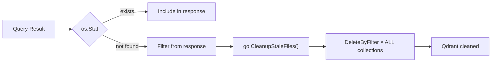

# RagCode MCP: System Architecture

RagCode is not a naive text-chunking RAG wrapper. It is a highly optimized, branch-aware, AST-driven semantic navigation engine designed specifically for Senior AI Agents constrained by context windows (Cursor, Windsurf, Copilot). 

This document serves as the definitive reference for core developers, tracking the complex interactions between IPC transport, memory-efficient AST parsing, and hybrid vector heuristics.

---

## 1. Transport & Process Architecture (Daemon + Adapter)

IDEs cannot afford external MCP servers consuming gigabytes of RAM or causing blocking I/O inside the editor's main thread. RagCode solves this via a dual-process bridge.

*   **Adapter Mode (The Bridge)**: A completely ephemeral, lightweight process (~1MB RAM) spawned via IDE configuration (`mcp.json`). It bridges `stdio` JSON-RPC streams by pushing them over to a persistent Unix domain socket.
*   **Daemon Mode (The Heavy Engine)**: The persistent backend process (`--daemon`) that holds Qdrant gRPC connections, Ollama LLM embeddings, and the AST Registry in memory.

### Micro-Features & Engineering Highlights:
- **Zero-Downtime Auto-Respawn**: If the Adapter detects it is a newer binary version than the currently running Daemon, it gracefully sends a kill signal and respawns the Daemon. 
- **Persistence Against IDE Restarts**: The Unix Socket (`~/.ragcode/daemon.sock`) outlives the IDE window. Multiple instances of Cursor/Windsurf can connect to the same Daemon concurrently without duplicating vector environments.

---

## 2. Advanced Workspace Detection & Isolation

Standard MCP servers fail in monorepos, deeply nested vendor directories, or multi-root Git repositories. They either index the entire laptop or duplicate collections on every sub-folder open. RagCode implements a unified, ascending registry resolver to guarantee perfect index safety and isolation.

### Micro-Features & Engineering Highlights:
- **Nested Submodule & Monorepo Safety**: The `Detector` walks up from the AI's active file path to identify root ecosystem markers (`go.mod`, `package.json`, `composer.json`, `.git`). If a nested marker (e.g., a `.git` submodule inside a backend folder) is found *inside* an already registered master workspace, the `Registry` intelligently prevents fragmentation. It suppresses the nested alias and maps the AI back to the parent workspace's root, ensuring the engine retains full context of the entire monorepo without duplicating vector collections.
- **Strict Branch-Aware Context Isolation**: A project is not just a path; it is a path *at a specific point in time*. The `WorkspaceID` used to map a project to a Qdrant collection is mathematically derived using a hash of the `Path + Git Branch + Worktree`. **Switching a Git branch instantly provisions a clean, isolated vector space** without overlapping definitions or vector pollution.
- **Deduplication via Caching Registry**: Resolving a workspace path requires disk I/O. Results are persistently cached via a JSON dictionary (`aliases` to `workspace_id`) inside the `.ragcode` hidden folder. Subsequent IDE queries skip the filesystem traverse and `O(1)` map directly to their Qdrant collection.
- **X-Workspace-Hint Override & Path Recovery**: IDEs launch MCP adapters in unpredictable environments (e.g., an arbitrary `pwd`). The engine merges `X-Workspace-Hint` header values passed by the client, environment variables (`RAGCODE_WORKSPACE`), and dynamic resolution paths from explicit MCP tool arguments (`file_path`) to lock onto the correct environment regardless of how the AI was initialized.

---

## 3. Deep AST Parsing Layer

Naive RAG systems chunk code into arbitrary 1000-character blocks, often splitting a function exactly in half. RagCode uses native Abstract Syntax Tree (AST) parsers to generate context-complete `Symbols`.

*   **Go & Python**: Full native Tree-sitter AST traversal.
*   **PHP Ecosystem**: Deep inspection not just for Vanilla PHP, but specifically extracting macros for Laravel (Eloquent, Routes, Controllers) and WordPress (Hooks, Widgets, WooCommerce, Oxygen Builder).
*   **JS / TS**: Native coverage for React, Vue, Next.js, and Node modules.
*   **HTML & CSS**: HTML semantic sectioning via goquery; CSS/SCSS/SASS/LESS parsing via tree-sitter.
*   **Documentation**: Structural mapping for Markdown, JSON, YAML, XML, and TOML.

### Micro-Features & Engineering Highlights:
- **Dynamic Symbol Hydration**: Every chunk contains exact Byte Offsets, Line Boundaries, Type Signatures, and Docstrings, allowing `rag_read_file_context` to perform `O(1)` file seeks instead of regex matching.

---

## 4. The Smart Search Pipeline (The Crown Jewel)

The `internal/service/tools/smart_search.go` pipeline is designed to eliminate AI "decision fatigue". The agent sends a query; the Engine does the heavy lifting.

### Micro-Features & Engineering Highlights:
- **Concurrent Dual Search Execution**: `rag_search` fires both a Semantic Vector Search (Qdrant) and a Lexical/AST structural search concurrently using goroutines. Cost: `max(semantic_latency, exact_latency) ≈ 100ms`, with zero penalty.
- **Vector Deduplication & Provenance**: Results are merged on vector IDs and tagged dynamically (`_source: "semantic" | "hybrid" | "both"`), letting the AI evaluate the algorithm's confidence.
- **Path-Scoped Contextual Rescoring (60/40 Split)**: Scores from Qdrant are purely mathematical. RagCode dynamically boosts a result's score by up to 40% if the discovered symbol shares the same directory structure or nomenclature as the AI's currently active file. Proximate code always wins.
- **Adaptive Context Formatting**:
  - *Compact Mode*: If the search returns > 4 items or confidence is low, the pipeline strips the source code and returns only signatures/paths (saving up to ~17,000 tokens per prompt).
  - *Full Mode*: Returns the complete source code only for high-confidence, tight matches.
- **Zero-Wait Fallback AST Search**: If the user has just opened the project and Qdrant is still indexing, the pipeline instantly falls back to direct in-memory AST parsing. The AI is never blocked.

---

## 5. Index Health & Lazy Stale Cleanup

LLMs suffer from extreme hallucinations when fed outdated search indexes (e.g., deleted functions). RagCode includes an active health-check matrix directly in the query output and a self-healing cleanup mechanism.

### Micro-Features & Engineering Highlights:
- **Pre-flight Disk Verification**: Before returning a vector match, RagCode verifies if the underlying file chunk still exists on disk via `os.Stat()`. Results from deleted files are **silently filtered out** — they never reach the AI agent.
- **Lazy Stale Cleanup (Auto-Purge)**: When a stale file is discovered during a search, the engine doesn't just warn — it triggers an **asynchronous deletion** of all vectors for that file from every language collection in the workspace (Go, Python, PHP, docs). This is a zero-cost self-healing mechanism:

- **Deduplication Cooldown (10min TTL)**: A `sync.Map` cache prevents the same stale file from being deleted repeatedly across consecutive queries. Entries expire after 10 minutes, allowing retries if a previous cleanup failed.
- **Warning Injection with Auto-Cleanup Note**: The response includes a `🧹 N stale file(s) detected and filtered out. Auto-cleanup triggered.` message, giving the AI full observability into what happened.
- **Chronological Awareness**: The response schema appends `index_age` (e.g., `"3 minutes ago"`) and real-time state (`indexing_progress`) so the AI makes decisions based strictly on cache validity.

---

## 6. Telemetry, Savings & Observable RAG

Providing the AI with a subset of code (200 tokens) instead of a dumped file (15,000 tokens) saves massive bandwidth.

### Micro-Features & Engineering Highlights:
- **Live Token Savings Evaluation**: Every `read` action calculates exactly how many bytes were avoided vs raw file injection.
- **JSONL Insights Logs**: Emits structured logs containing vector match reasons and scores, allowing both human developers and the agent to evaluate why a specific block of code was selected over another (`rag_evaluate`).

---

## 7. Skill Ecosystem (`.ragcode/skills`)

A modular framework that allows AI agents to self-install tools.

*   By invoking `rag_list_skills` and `rag_install_skill`, the agent can pull specific behavioral extensions (like debugging protocols or external APIs) into the local `.ragcode/skills` directory, actively expanding its own reasoning capabilities without restarting the Daemon.
