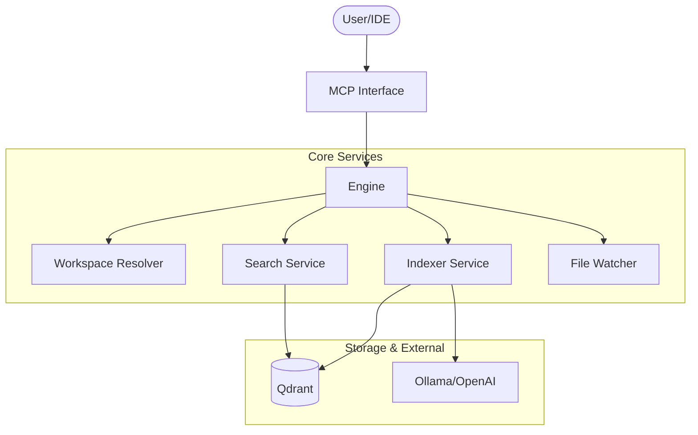

# Engine Service

The `engine` package is the **central orchestrator** of the RAG Code search tool. It wires together workspace detection, indexing, searching, and MCP tool handling into a unified, high-level API.

## 🎯 Objectives

The Engine ensures:
- **Workspace Resolution**: Cascade detection of project roots based on file paths, aliases, or background state.
- **Service Coordination**: Acting as the "glue" between `Indexer`, `Search`, `Resolver`, and `Watcher`.
- **Background Operations**: Handing long-running indexing tasks without blocking user requests.
- **Git Awareness**: Automatically triggering re-indexing when branch changes or HEAD updates are detected.
- **Skill Management**: Installation and prioritization of specialized domain knowledge.

---

## 🏗️ Architecture



---

## 🔍 Key Responsibilities

### 1. Workspace Resolution
The Engine uses a deterministic resolver to find where code "lives":
- **Explicit**: User provided root.
- **Detected**: Finding `.git` or `go.mod` from an active file.
- **Remembered**: Using the Registry to find the last confirmed workspace.

### 2. Intelligent Indexing
Delegates to `pkg/indexer` while managing high-level logic:
- Handles `StartIndexingAsync` to keep the UI responsive.
- Listens to Git signals (`ReindexRequired`) to keep the database in sync with the current branch.

### 3. Semantic Search
Orchestrates the search flow:
- Detects the correct collection/language for a project.
- Combines code search, documentation search, and (optionally) Hybrid search.

---

## 🔄 Lifecycle Example: Search Flow

1. **Request**: User asks "How is authentication handled?" in a `.go` file.
2. **Context**: Engine detects the Go workspace root using `resolver`.
3. **Validation**: Engine checks if the current Git HEAD matches the index (`branch_state.json`).
4. **Trigger**: If Git has changed, Engine starts an incremental re-index in the background.
5. **Search**: Engine calls `SearchService` to find the most relevant chunks in the Qdrant collection.
6. **Result**: Engine returns formatted symbols and context to the MCP layers.

---

## 🚀 Usage

The Engine is typically initialized once at startup in `main.go`:

```go
engine := engine.NewEngine(
    indexerSvc,
    searchSvc,
    registryPath,
    config,
)
```

### Core API
- `DetectContext(ctx, path)`: Resolves project root and metadata.
- `IndexWorkspace(ctx, root, recreate)`: Triggers full/incremental indexing.
- `SearchCode(ctx, path, query, limit)`: Performs semantic vector search.
- `StartIndexingAsync(root, id, files, recreate)`: Runs indexing in background.
