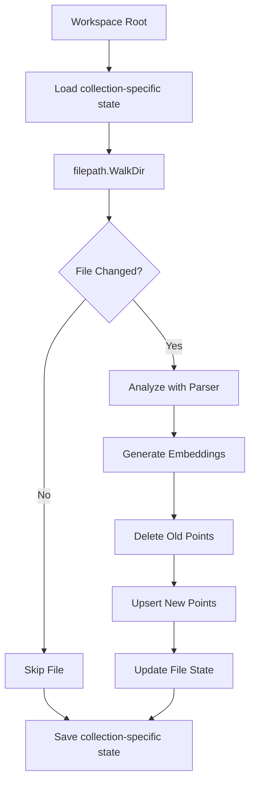

# Indexer Module

The `indexer` package providing **intelligent workspace indexing**, leveraging file-level state tracking (Embedding Cache) to perform lightning-fast incremental updates and minimize redundant LLM operations.

## 🎯 Objectives

The indexer ensures:
- **Change Detection**: Track file modification times and sizes to identify exactly what needs re-indexing.
- **Incremental Updates**: Only process new or modified files, drastically reducing token usage and processing time.
- **Batch Processing**: Optimize database performance by batching vector upsert operations.
- **State Persistence**: Maintain one `.ragcode/state-<collection-hash>.json` per branch/language collection.
- **Metadata Management**: Properly tag each indexed chunk with file paths, package names, and symbol types.

Upgrade note: the former shared `.ragcode/state.json` cannot be assigned safely to a branch collection. It is removed on the first indexing run, which performs one full reindex for each collection.

---

## 📊 Data Flow



---

## 🏗️ Package Structure

*   **state.go**: Manages collection-specific file modification snapshots.
*   **service.go**: Main orchestrator that implements the high-level `IndexWorkspace` and `IndexFile` operations.

---

## 🔍 Key Types

### State (Persistent Index Metadata)
```go
type State struct {
    Files map[string]FileState // Path -> modification snapshot
}

type FileState struct {
    Path    string
    ModTime time.Time
    Size    int64
}
```

### Options
```go
type Options struct {
    ExcludePatterns []string // Directories to skip (e.g. node_modules)
    Recreate        bool     // Force a full clean index
}
```

---

## 🔄 Indexing Workflow

### Scenario 1: Initial Indexing
- No collection-specific state exists.
- All supported files are analyzed and embedded.
- Full collection-specific state is generated.

### Scenario 2: Incremental Run (Minor Change)
- The collection-specific state is loaded.
- 1000 files scanned, only 1 file modified.
- `Indexer` deletes only the points related to that 1 file from the database.
- Only the 1 file is analyzed and sent to Ollama/OpenAI.
- Process completes in seconds rather than minutes.

---

## 🚀 Usage Examples

### Indexing a Workspace
```go
indexerSvc := indexer.NewService(llmProvider, vectorStore)

err := indexerSvc.IndexWorkspace(
    ctx,
    "/home/user/project",
    "ragcode-myproject-go",
    indexer.Options{
        ExcludePatterns: []string{"vendor"},
        Recreate:        false,
    },
)
```

---

## ✅ Integration Points

- **Engine**: The high-level orchestrator that triggers indexing based on workspace resolution or file system events.
- **Storage**: The `VectorStore` interface used to persist and clean up code segments.
- **Parser**: Used to extract meaningful symbols and docstrings from source files.
- **LLM**: Used to generate vector embeddings for the extracted code chunks.
