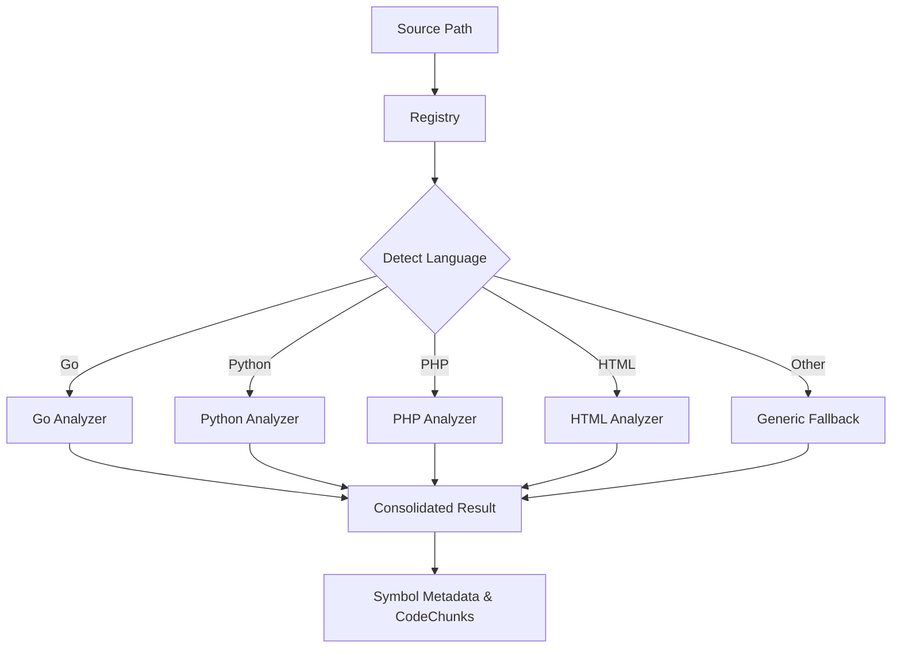

# RagCode Parser System (V2)

The `parser` package is the core engine of RagCode's code analysis capabilities. it provides a unified interface and a registry-based system to extract structured information (symbols, documentation, relationships) from various programming and markup languages.

## 🏗️ Architecture Overview

The system is built on a modular, plug-and-play architecture where each language-specific analyzer registers itself with a central registry.



## 🛠️ Main Interface: `Analyzer`

All language parsers must implement the following interface defined in `parser.go`:

```go
type Analyzer interface {
	// Name returns the analyzer name (e.g., "golang", "python").
	Name() string
	
	// CanHandle returns true if the analyzer supports the given file extension.
	CanHandle(filePath string) bool
	
	// Analyze extracts symbols from a file or directory.
	Analyze(ctx context.Context, path string) (*Result, error)
}
```

## 📂 Supported Languages

Click on each language to see the detailed technical documentation for its specific analyzer:

| Language | Directory | Description | Status |
|----------|-----------|-------------|--------|
| **Go** | [`/go`](./go/README.md) | Native AST parsing with full documentation support. | ✅ Production |
| **Python** | [`/python`](./python/README.md) | Robust regex & indentation analysis. | ✅ Production |
| **PHP** | [`/php`](./php/README.md) | Deep Laravel integration (Eloquent, Routes, Controllers) & WordPress. | ✅ Production |
| **HTML & CSS** | [`/html`](./html/README.md) | HTML semantic sectioning + CSS/SCSS/SASS/LESS via tree-sitter. | ✅ Production |
| **JavaScript** | [`/javascript`](./javascript/README.md) | React, Vue, & TypeScript support. | ✅ Production |
| **Docs** | [`/docs`](./docs/README.md) | Markdown, JSON, YAML, XML, TOML, reStructuredText. | ✅ Production |
| **Generic** | [`/generic`](./generic/README.md) | Universal regex-based fallback for other languages. | ✅ Production |

## 🚀 Unified Symbol Model

Every analyzer returns a `Symbol` structure, ensuring that the embedding and indexing pipeline remains language-agnostic:

| Field | Type | Description |
|-------|------|-------------|
| `Name` | `string` | The identifier name (e.g., function name, class name). |
| `Type` | `SymbolType` | Kind of symbol (`function`, `method`, `class`, `struct`, etc.). |
| `Signature`| `string` | Complete source line definition. |
| `Docstring`| `string` | Extracted comments or documentation. |
| `Metadata` | `map[string]any`| Language-specific attributes (e.g., `is_async`, `is_exported`). |

## 💻 Global Usage Example

```go
import (
    "context"
    "github.com/doITmagic/rag-code-mcp/pkg/parser"
    _ "github.com/doITmagic/rag-code-mcp/pkg/parser/go"
    _ "github.com/doITmagic/rag-code-mcp/pkg/parser/python"
)

func main() {
    // 1. Get appropriate analyzer by file extension
    analyzer := parser.GetByFile("main.py")
    
    // 2. Perform deep analysis
    result, err := analyzer.Analyze(context.Background(), "path/to/code")
    
    // 3. Use unified results
    for _, sym := range result.Symbols {
        fmt.Printf("[%s] Found %s: %s\n", sym.Language, sym.Type, sym.Name)
    }
}
```
