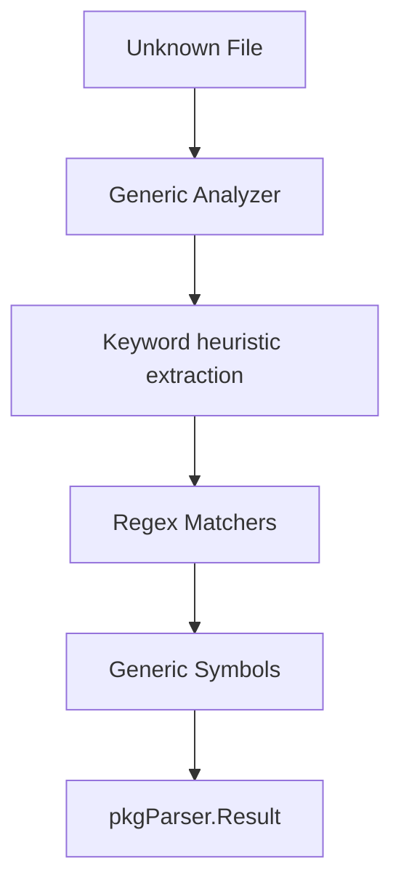

# Generic Parser

The `generic` package provides a "fallback" analyzer for languages that do not yet have a dedicated parser (e.g., C#, Java, Ruby, Shell). It uses simple heuristics and universal patterns to segment code files.

## 🎯 Objectives

Ensures that no code file remains unindexed, even if native support for the specific language's syntax is not yet available.

### Extracted Symbols:
1.  **Generic Functions**: Detected through patterns such as `func name()`, `def name()`, `void name()`.
2.  **Classes**: Identified by the `class` keyword.
3.  **Comments**: Extracts comment blocks of types `//`, `#`, `/* */`.
4.  **Full File**: If no structure is identified, it treats the entire file as a single unit.

---

## 📊 Data Flow



---

## 🏗️ Package Structure

*   `analyzer.go`: Contains the fallback logic and the set of universal regexes.

---

## 🔍 Extraction Example

### Source Code (e.g., Ruby):
```ruby
# Greets the user
def say_hello(name)
  puts "Hello, #{name}"
end
```

### Result (Symbol Metadata):
| Field | Value |
|------|---------|
| `Name` | `"say_hello"` |
| `Type` | `"function"` |
| `Docstring` | `"Greets the user"` |
| `Language` | `"generic"` |

---

## 💻 Usage

```go
import (
    "github.com/doITmagic/rag-code-mcp/pkg/parser/generic"
)

// Used manually when GetByFile returns nil
analyzer := generic.NewAnalyzer()
result, err := analyzer.Analyze(ctx, "script.rb")
```

---

## 📋 Technical Notes

*   **Precision**: As a generic parser, signature precision may vary.
*   **Fallback**: Always the last option attempted by the indexing system.
