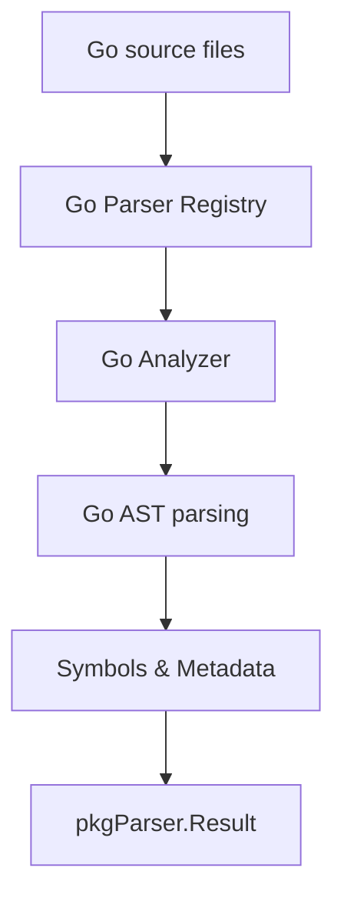

# Go Parser

The `go` package implements a source code analyzer for the **Go** programming language, utilizing the standard `go/ast` library to extract structured symbols and documentation.

## 🎯 Objectives

The Go analyzer is designed to convert source code into semantic units (CodeChunks) that can be indexed for semantic search or used in static analysis pipelines.

### Extracted Symbols:
1.  **Functions**: Package-level functions.
2.  **Methods**: Functions associated with a receiver (struct or other defined types).
3.  **Types**: Declarations of `struct`, `interface`, and `type aliases`.
4.  **Constants**: Const values defined at the package level.
5.  **Variables**: Package-level global variables.

---

## 📊 Data Flow



---

## 🏗️ Package Structure

*   `types.go`: Defines internal data structures (e.g., `CodeChunk`, `FunctionInfo`, `TypeInfo`).
*   `analyzer.go`: Implements the `parser.Analyzer` interface. Uses recursive logic to navigate the AST.
*   `api_analyzer.go`: Extension for specific API documentation analysis.
*   `analyzer_test.go`: Test suite to validate extraction accuracy.

---

## 🔍 Extraction Example

### Go Source Code:
```go
// Calculator performs simple mathematical operations.
type Calculator struct {
    ID int
}

// Add returns the sum of two integers.
func (c *Calculator) Add(a, b int) int {
    return a + b
}
```

### Result (Symbol Metadata):
| Field | Value |
|------|---------|
| `Name` | `"Add"` |
| `Type` | `"method"` |
| `Signature` | `"func (c *Calculator) Add(a int, b int) int"` |
| `Receiver` | `"*Calculator"` |
| `Docstring` | `"Add returns the sum of two integers."` |

---

## 💻 Usage

The analyzer automatically registers itself in the central parser registry via the `init()` function.

```go
import (
    "context"
    "github.com/doITmagic/rag-code-mcp/pkg/parser"
    _ "github.com/doITmagic/rag-code-mcp/pkg/parser/go"
)

func main() {
    analyzer := parser.GetByName("golang")
    result, err := analyzer.Analyze(context.Background(), "./pkg")
    // ... process result.Symbols
}
```

---

## 📋 Metadata and Types

| Symbol Type | Included Metadata |
|------------|-----------------|
| `function` | `parameters`, `returns`, `is_exported` |
| `method`   | `receiver`, `is_method`, `class_name` |
| `struct`   | `fields`, `tags`, `is_exported` |
| `const`    | `value`, `is_exported` |
