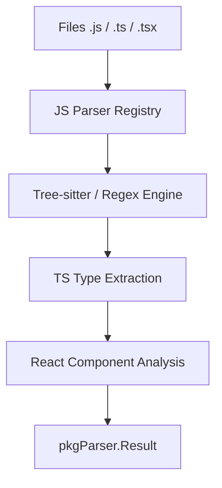

# JavaScript & TypeScript Parser

The `javascript` package implements a code analyzer for the **JavaScript** and **TypeScript** ecosystem, covering `.js`, `.ts`, `.jsx`, and `.tsx` files. It utilizes Tree-sitter (planned) or regex-based analyzers to extract core structures of modern web applications.

## 🎯 Objectives

The analyzer is optimized to understand the modular structure of JavaScript and the rigorous typing of TypeScript.

### Extracted Symbols:
1.  **Functions**: Classic declarations (`function`) and `Arrow Functions`.
2.  **Classes & Methods**: Support for OOP in JS/TS, including constructors and asynchronous methods.
3.  **React Components**: Identifies functional and class components in JSX/TSX files.
4.  **Types & Interfaces**: Extracts TypeScript type definitions for semantic context.
5.  **Modules**: Manages `import` and `export` to determine dependencies.

---

## 📊 Data Flow



---

## 🏗️ Package Structure

*   `types.go`: Data structures for UI components and JS functions.
*   `analyzer.go`: Implements the `parser.Analyzer` interface.
*   `README.md`: Documentation and implementation roadmap.

---

## 🔍 Extraction Example

### TypeScript Source Code (React):
```tsx
interface Props { name: string; }

/** Displays the user's profile. */
export const UserProfile = ({ name }: Props) => {
    return <div>{name}</div>;
};
```

### Result (Symbol Metadata):
| Field | Value |
|------|---------|
| `Name` | `"UserProfile"` |
| `Type` | `"function"` |
| `Metadata.is_component` | `true` |
| `Metadata.props` | `["name"]` |
| `Docstring` | `"Displays the user's profile."` |

---

## 💻 Usage

```go
import (
    "context"
    "github.com/doITmagic/rag-code-mcp/pkg/parser"
    _ "github.com/doITmagic/rag-code-mcp/pkg/parser/javascript"
)

func main() {
    analyzer := parser.GetByName("javascript")
    result, err := analyzer.Analyze(context.Background(), "./src")
    // ... process components
}
```

---

## 📋 Roadmap & Frameworks

| Technology | Status | Notes |
|------------|--------|------|
| **Pure JS/TS** | ✅ Active | Functions, Classes, Types. |
| **React** | 🔄 In Progress | Props & Hooks extraction. |
| **Vue / Svelte** | 📅 Planned | Support for single-file component formats. |
| **NestJS** | 📅 Planned | Decorator analysis and Dependency Injection. |
