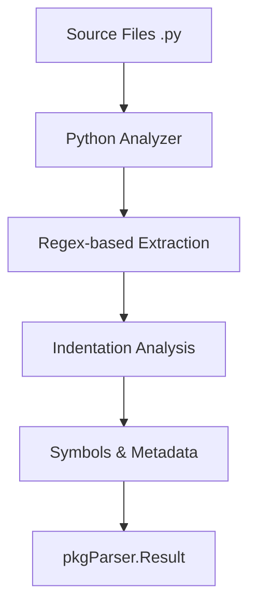

# Python Parser

The `python` package implements a source code analyzer for the **Python** language, using optimized regular expressions and indentation logic to extract structured symbols without requiring a local interpreter.

## 🎯 Objectives

The Python analyzer identifies essential components of a Python script or package, providing rich metadata for each entity.

### Extracted Symbols:
1.  **Modules**: Extracts file-level docstrings and identifies package names based on the directory structure.
2.  **Classes**: Detects class definitions, inheritance bases (`bases`), and metaclasses.
3.  **Methods**: Functions defined inside classes, detecting specialized decorators (`@property`, `@staticmethod`, `@classmethod`).
4.  **Functions**: Module-level functions.
5.  **Variables/Constants**: Identifies global variables and constants (based on the `UPPER_CASE` naming convention).

---

## 📊 Data Flow



---

## 🏗️ Package Structure

*   `types.go`: Defines detailed internal structures (e.g., `ClassInfo`, `MethodInfo`, `ParamInfo`).
*   `extract.go`: Contains the regex-based analysis engine and the indentation-based block detection logic.
*   `analyzer.go`: Implements the `parser.Analyzer` interface and coordinates the file scanning process.
*   `analyzer_test.go`: Unit tests for validating extraction across various Python coding styles.

---

## 🔍 Extraction Example

### Python Source Code:
```python
class Calculator:
    """Performs mathematical calculations."""
    
    @staticmethod
    def add(a: int, b: int) -> int:
        return a + b
```

### Result (Symbol Metadata):
| Field | Value |
|------|---------|
| `Name` | `"add"` |
| `Type` | `"method"` |
| `Signature` | `"def add(a: int, b: int) -> int"` |
| `Metadata.class` | `"Calculator"` |
| `Metadata.is_static` | `true` |
| `Docstring` | `"Method docstring"` |

---

## 💻 Usage

```go
import (
    "context"
    "github.com/doITmagic/rag-code-mcp/pkg/parser"
    _ "github.com/doITmagic/rag-code-mcp/pkg/parser/python"
)

func main() {
    analyzer := parser.GetByName("python")
    result, err := analyzer.Analyze(context.Background(), "./scripts")
    // ... process result.Symbols
}
```

---

## 📋 Python Particularities

| Element | Extraction Logic |
|---------|---------------------|
| **Docstrings** | Support for `"""` and `'''`, immediately following a definition. |
| **Inheritance** | Extracts base classes from class definition parentheses. |
| **Types** | Extracts type annotations for parameters and return values. |
| **Indentation** | Determines block boundaries (`def`/`class`) by monitoring line indentation levels. |
