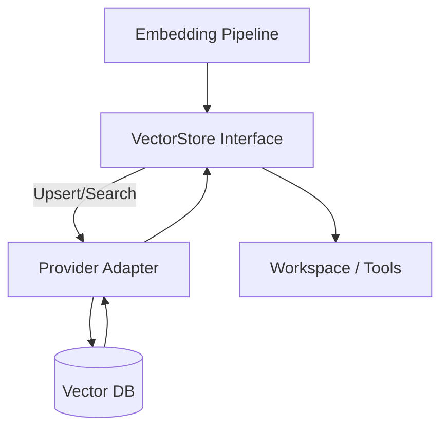

# RagCode Vector Storage Layer (V2)

The `storage` package provides a unified abstraction over vector databases used by RagCode. It focuses on deterministic semantics for upserts, searches, and collection lifecycle management, letting higher layers switch storage backends without touching business logic.

## 🏗️ Architecture Overview

The storage layer is split between a clean interface contract and concrete adapters. Requests flow through a single entry point (`VectorStore`) that fans out to provider-specific clients (currently Qdrant) and optional instrumentation hooks.



## 🛠️ Core Interfaces

### VectorStore (`interface.go`)
Defines the canonical contract for:
- `Upsert` batches of `Point`s (ID, vector, payload)
- Multiple search flavors (general, docs-only, code-only, custom chunk types)
- Collection lifecycle helpers (`CollectionExists`, `CreateCollection`, `GetCollectionInfo`, `GetCollectionPointCount`)
- Strongly typed query parameters via `SearchQuery`, `SearchResult`, `CollectionInfo`.

### Qdrant Adapter (`qdrant.go`)
- Production-grade implementation backed by `github.com/qdrant/go-client/qdrant`.
- Handles collection bootstrap, payload marshalling, chunk-type filtering, and result normalization.
- Provides helper funcs (`normalizeLimit`, `buildFilter`, `matchKeyword`) for consistent query behavior.
- Exposes `NewQdrantStore` for real connections and `NewQdrantStoreWithClient` for tests.

### Tests (`qdrant_test.go`)
- Use fake clients to assert collection creation, filter composition, and error propagation.
- Cover docs-only/code-only searches and safeguard against nil responses.

## 📂 Module Overview

| Module | Directory | Purpose | Status |
|--------|-----------|---------|--------|
| **Interface** | [`interface.go`](./interface.go) | Public contract & shared types. | ✅ Production |
| **Qdrant Adapter** | [`qdrant.go`](./qdrant.go) | Qdrant-backed `VectorStore` implementation. | ✅ Production |
| **Qdrant Tests** | [`qdrant_test.go`](./qdrant_test.go) | Adapter coverage & regression tests. | ✅ Production |

## 🔄 Request Flow

```
Embedding / indexing job
    ↓
VectorStore.Upsert()
    ↓
Adapter maps points → provider structs
    ↓
Provider client persists vectors
    ↓
Queries call VectorStore.Search*
    ↓
Adapter builds filters (chunk_type, file, language)
    ↓
Provider returns scored points
    ↓
Adapter normalizes payloads for tools/workspace
```

## 🎯 Key Concepts

### Points & Payloads
Each vector is wrapped in a `Point` with a string `ID` and arbitrary metadata. Payloads carry file paths, chunk IDs, chunk types, languages, etc., giving downstream tools full context without extra lookups.

### Chunk-Type Filtering
Search helpers (`SearchDocsOnly`, `SearchCodeOnly`, `SearchByChunkType`) enforce consistent semantics for documentation vs. code results. They build deterministic filters so UI/CLI consumers get predictable slices of the index.

### Provider-Agnostic Contract
Only the adapter knows about provider-specific types. Everything else (workspace manager, tools, MCP layer) talks to `VectorStore`, enabling future backends (Milvus, Pinecone, SQLite) without cascading refactors.

## 🚀 Getting Started

```go
package main

import (
    "context"

    "github.com/doITmagic/rag-code-mcp/pkg/storage"
)

func main() {
    ctx := context.Background()

    store, err := storage.NewQdrantStore("localhost", 6334, false, "")
    if err != nil {
        panic(err)
    }

    // Ensure collection exists
    const collection = "ragcode-go"
    exists, _ := store.CollectionExists(ctx, collection)
    if !exists {
        if err := store.CreateCollection(ctx, collection, 1536); err != nil {
            panic(err)
        }
    }

    // Upsert a sample point
    _ = store.Upsert(ctx, collection, []storage.Point{
        {
            ID:     "file.go#chunk-1",
            Vector: []float32{0.1, 0.2, 0.3},
            Payload: map[string]interface{}{
                "file":       "internal/tools/example.go",
                "chunk_type": "code",
            },
        },
    })

    // Query similar chunks
    results, err := store.Search(ctx, collection, storage.SearchQuery{
        Vector: []float32{0.1, 0.2, 0.3},
        Limit:  5,
    })
    if err != nil {
        panic(err)
    }
    for _, r := range results {
        println(r.Point.ID, r.Score)
    }
}
```

## 📚 Further Reading

- [Qdrant Adapter Source](./qdrant.go) – Implementation details & helpers
- [Qdrant Tests](./qdrant_test.go) – Mock-based coverage patterns
- [Workspace Package](../workspace/README.md) – How storage integrates with detection/resolution
- [Embedding Package](../embedding) – Producers of vectors consumed by storage
