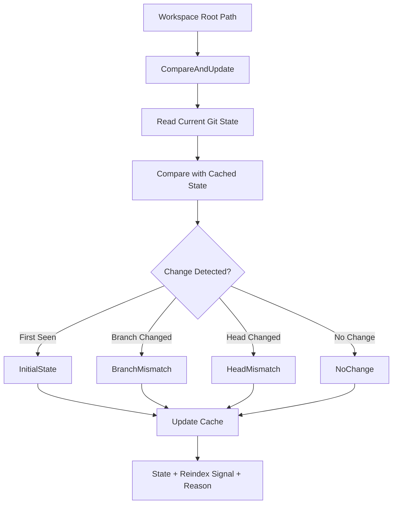

# BranchState Module

The `branchstate` package provides **git metadata enrichment and invalidation detection**, enabling detection of branch changes, HEAD rewrites, and worktree transitions that signal reindexing needs.

## 🎯 Objectives

The branchstate manager ensures:
- **Metadata Tracking**: Record branch, HEAD SHA, and worktree ID per workspace
- **Invalidation Detection**: Identify when metadata changes trigger reindexing
- **Risk Assessment**: Quantify mismatch risk (low/medium/high) based on branch state
- **Cache Isolation**: Use derived identifiers to isolate cache across branches
- **TTL Management**: Expire cached state on configurable timeout

### Detected Signals:
1. **FIRST_SEEN**: New workspace, no prior state recorded
2. **BRANCH_CHANGED**: Branch name differs from last recorded state
3. **HEAD_CHANGED**: HEAD SHA differs (commit history changed)
4. **WORKTREE_SWITCHED**: Working tree changed (multi-worktree scenario)

---

## 📊 Data Flow



---

## 🏗️ Package Structure

*   **state.go**: Core state tracking, comparison, and TTL management
*   **state_test.go**: Unit tests for branch transitions, TTL expiration, and edge cases

---

## 🔍 Key Types

### State (Cached Workspace Metadata)
```go
type State struct {
    WorkspaceRoot string    // Absolute path
    LastBranch    string    // Previous branch name
    LastHead      string    // Previous HEAD SHA
    LastWorktreeID string   // Worktree identifier
    LocalTime     time.Time // When state was recorded
}
```

### Manager Options
```go
type Manager struct {
    cacheTTL time.Duration // How long to cache state (0 = no cache)
    logger   Logger        // Optional structured logger
    cache    *State        // In-memory cache
}
```

---

## 🔄 State Transitions

### Scenario 1: First Time (No Cached State)
```
Input: /home/user/project
Cache: (empty)
    ↓
Current: branch="main", head="abc123", worktree="wt-1"
    ↓
Output:
  - ReindexRequired: true
  - Reason: "FIRST_SEEN"
  - Risk: "low" (expected state)
```

### Scenario 2: Branch Switch (Same Worktree)
```
Input: /home/user/project
Cache: branch="main", head="abc123"
    ↓
Current: branch="feature/new", head="def456"
    ↓
Output:
  - ReindexRequired: true
  - Reason: "BRANCH_CHANGED"
  - Risk: "high" (different symbol scope)
```

### Scenario 3: Fast-Forward Merge (Same Branch)
```
Input: /home/user/project
Cache: branch="main", head="abc123"
    ↓
Current: branch="main", head="def456" (FF commit)
    ↓
Output:
  - ReindexRequired: true
  - Reason: "HEAD_CHANGED"
  - Risk: "medium" (same branch, new symbols)
```

### Scenario 4: No Change (Repeated Call)
```
Input: /home/user/project
Cache: branch="main", head="abc123"
    ↓
Current: branch="main", head="abc123"
    ↓
Output:
  - ReindexRequired: false
  - Reason: "" (unchanged)
  - Risk: "low"
```

---

## 🚀 Usage Examples

### Basic Enrichment
```go
manager := branchstate.NewManager(
    branchstate.WithCacheTTL(5 * time.Minute),
)

state, reindex, reason, err := manager.CompareAndUpdate(
    context.Background(),
    "/home/user/project",
)
if err != nil {
    // Non-git folders return graceful fallback
    println("Not a git repo or error:", err)
}

println("Reindex Required:", reindex)
println("Reason:", reason)

if state != nil {
    println("Branch:", state.LastBranch)
    println("HEAD:", state.LastHead)
}
```

### Risk Assessment Integration
```go
annotator := &BranchAnnotator{
    manager: manager,
}

resp := &contract.ResolveWorkspaceResponse{}
annotator.Annotate(ctx, "/home/user/project", resp)

// Response now includes:
// - resp.Branch: current branch
// - resp.HeadSHA: current HEAD
// - resp.ReindexRequired: bool
// - resp.MismatchRisk: "low"|"medium"|"high"
// - resp.Reason: reason code
```

### Non-Git Fallback
```go
// Directory without .git/ is accepted gracefully
state, reindex, reason, err := manager.CompareAndUpdate(
    ctx,
    "/tmp/non-git-folder",
)
// err != nil (no .git detected)
// reindex = false (no point reindexing non-repo)
// reason = ""
```

---

## 📊 Risk Assessment Logic

| Condition | Risk | Confidence Decay |
|-----------|------|------------------|
| `FIRST_SEEN` (no cache) | `low` | × 1.0 (no decay) |
| `BRANCH_CHANGED` | `high` | × 0.6 (strong decay) |
| `HEAD_CHANGED` (same branch) | `medium` | × 0.8 (moderate decay) |
| No change (cache valid) | `low` | × 1.0 (no decay) |
| Non-git folder | `low` | × 1.0 (no decay) |

**Confidence decay** is applied to response confidence score when risk is elevated (used by resolver to communicate uncertainty).

---

## 💾 TTL & Cache Behavior

### With Cache TTL
```go
manager := branchstate.NewManager(
    branchstate.WithCacheTTL(5 * time.Minute),
)

// Call 1: Reads .git, caches state
state1, reindex1, _, _ := manager.CompareAndUpdate(ctx, path)
// reindex1 = true (first time)

// Call 2 (1 second later): Returns cached state
state2, reindex2, _, _ := manager.CompareAndUpdate(ctx, path)
// reindex2 = false (cache still valid)

// Call 3 (6 minutes later): Cache expired, re-read .git
state3, reindex3, _, _ := manager.CompareAndUpdate(ctx, path)
// reindex3 = true or false (depends on git state)
```

### Without Cache (TTL = 0)
```go
manager := branchstate.NewManager(
    branchstate.WithCacheTTL(0),  // Disabled
)

// Every call reads fresh git state (slower but always accurate)
```

---

## ✅ Error Handling

| Scenario | Response | Error |
|----------|----------|-------|
| Git repo, branch found | `state != nil, reindex signal` | ✅ OK |
| Non-git folder | `state == nil` | ✅ OK (graceful fallback) |
| Permission denied | `state == nil` | ❌ Error |
| Corrupted .git | `state == nil` | ❌ Error |

Non-git folders are **not** errors—they simply skip enrichment.

---

## 🔗 Integration Points

- **Resolver**: Returns annotator dependency
- **BranchAnnotator**: Calls `CompareAndUpdate()` during finalization
- **Engine**: Manages manager lifecycle
- **Contract**: Decorates `ResolveWorkspaceResponse` with metadata
