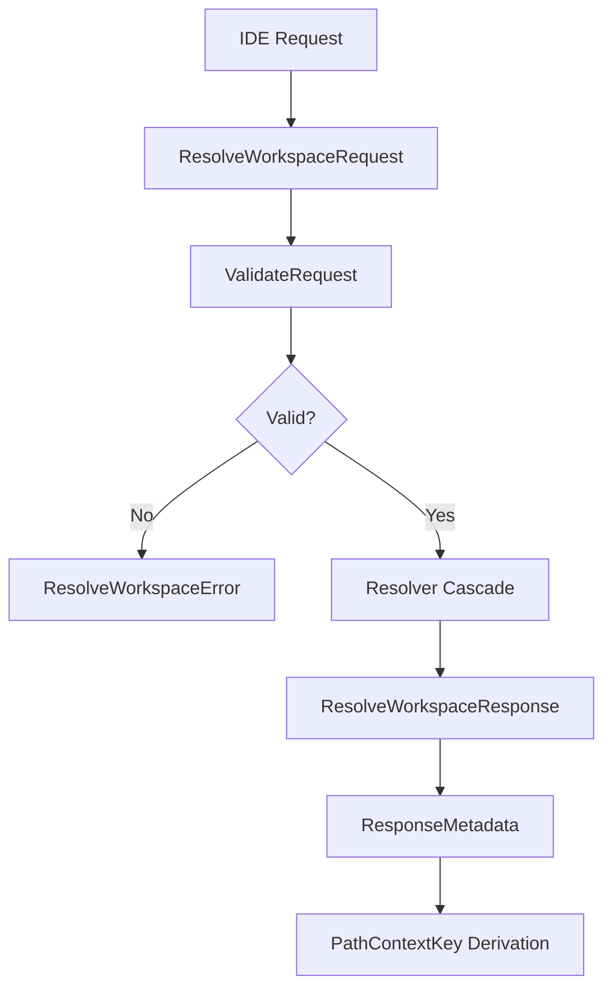

# Contract Module

The `contract` package defines the canonical request/response types and helper functions for workspace resolution, providing a stable API boundary between IDEs and the resolution engine.

## 🎯 Objectives

The contract module ensures:
- **Type safety**: All resolution operations use strongly-typed payloads
- **Validation**: Lightweight pre-flight checks before expensive operations
- **Traceability**: Reason codes explain every decision path
- **Determinism**: Derived IDs (workspace ID, context key) are reproducible

### Core Concepts:
1. **ResolveWorkspaceRequest**: IDE input (workspace root, file path, alias, roots list)
2. **ResolveWorkspaceResponse**: Resolution output (resolved root, metadata, candidates)
3. **PathFeedback**: IDE corrections/suggestions for mismatch scenarios
4. **WorkspaceID**: Content-based identifier for branch-aware cache isolation
5. **PathContextKey**: Unique context key to detect invalidation

---

## 📊 Data Flow



---

## 🏗️ Package Structure

*   **types.go**: Core data structures (Request, Response, Error, Candidate)
*   **types_test.go**: Unit tests for validation logic
*   **workspace_id.go**: WorkspaceID and PathContextKey derivation functions

---

## 🔍 Key Types

### ResolveWorkspaceRequest
```go
type ResolveWorkspaceRequest struct {
    WorkspaceRoot string             // Explicit root provided by IDE
    FilePath      string             // File path for detection
    Workspace     string             // Workspace alias
    Roots         []string           // List of candidate roots
    Client        ClientInfo         // IDE/client metadata
    Capabilities  ClientCapabilities // Feature support flags
    StrictMode    bool               // Require confirmation on ambiguity
    Feedback      *PathFeedback      // IDE feedback for mismatch
}
```

### ResolveWorkspaceResponse
```go
type ResolveWorkspaceResponse struct {
    ResolvedRoot         string           // Detected workspace root
    WorkspaceID          string           // Derived workspace ID
    PathContextKey       string           // Context key for invalidation detection
    Reason               ReasonCode       // How decision was made
    MismatchRisk         string           // low|medium|high confidence decay
    RequiresConfirmation bool             // Multiple candidates require IDE selection
    Candidates           []Candidate      // Ambiguous options
    Metadata             ResponseMetadata // Full diagnostic info
}
```

### ReasonCode
Deterministic codes explaining every decision path:
- `EXPLICIT_WORKSPACE_ROOT` – Workspace root provided directly
- `FILE_PATH` – Detected via file path analysis
- `WORKSPACE_ALIAS` – Resolved from registry
- `ROOTS_LIST` – Selected from provided roots
- `CONFIRMATION_REQUIRED` – Multiple candidates, IDE selection needed
- `BRANCH_CHANGED` – Branch transition detected
- `HEAD_CHANGED` – HEAD rewrite detected
- `FIRST_SEEN` – New workspace, no prior state

---

## 🚀 Usage Examples

### Validation
```go
req := contract.ResolveWorkspaceRequest{
    FilePath: "/home/user/project/main.go",
}
if err := contract.ValidateRequest(req); err != nil {
    log.Fatalf("Invalid request: %v", err)
}
```

### ID Derivation
```go
// Workspace ID (branch-aware, used for cache isolation)
wsID := contract.DeriveWorkspaceID(
    "/home/user/project",  // root
    "feature/new-feature", // branch
    "wt-proj-1",           // worktree ID
)

// Context key (detects HEAD/branch invalidation)
ctxKey := contract.DerivePathContextKey(
    "/home/user/project",
    "feature/new-feature",
    "abc123def456...",  // HEAD SHA
    "wt-proj-1",
)
```

### Feedback Handling
```go
feedback := &contract.PathFeedback{
    Status:             "mismatch",
    SuggestedPath:      "/home/user/actual-project",
    ExecutionSucceeded: true,
    Reason:             "IDE resolved to different root",
}

if err := contract.ValidateRequest(&contract.ResolveWorkspaceRequest{
    Feedback: feedback,
}); err != nil {
    log.Fatalf("Invalid feedback: %v", err)
}
```

---

## ✅ Validation Rules

1. **Request**: Must provide one of `workspace_root`, `file_path`, `workspace` alias, or `roots` list
2. **Feedback Status**: Must be empty or `"mismatch"`
3. **Feedback Path**: Suggested path must be canonical (no `../`, no non-existent)
4. **Execution Signal**: If `execution_succeeded=true`, must have `suggested_path`

---

## 🔗 Integration Points

- **Resolver**: Consumes `ResolveWorkspaceRequest`, returns `ResolveWorkspaceResponse`
- **Registry**: Stores confirmed entries; uses `WorkspaceID` as key
- **BranchState**: Enriches `ResponseMetadata` with branch/HEAD info
- **Engine**: High-level orchestrator using contract types
