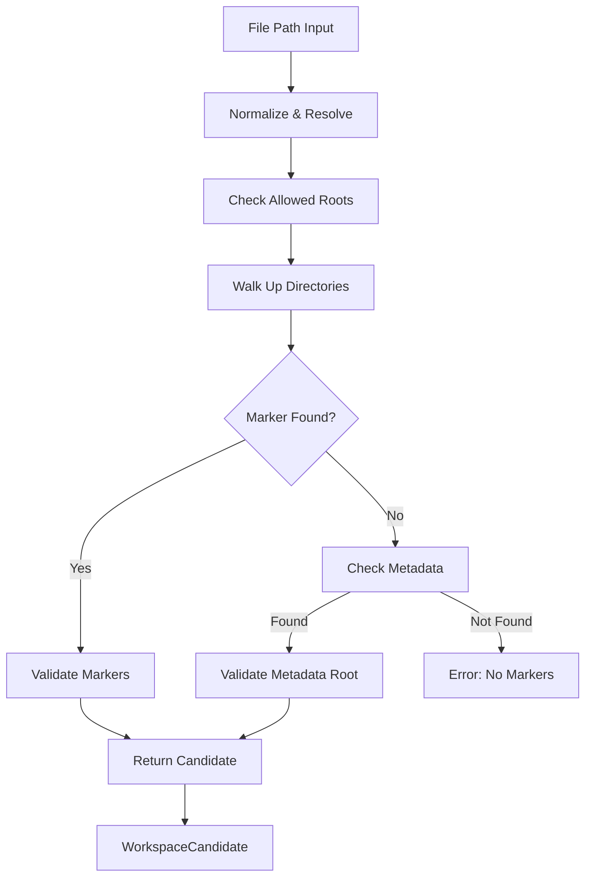

# Detector Module

The `detector` package implements **marker-based root detection** using upward directory traversal and security validation to identify workspace roots from file paths.

## 🎯 Objectives

The detector identifies workspace roots by:
1. Walking up directories from a starting path
2. Checking for language/framework markers (`.git`, `go.mod`, `package.json`, etc.)
3. Enforcing security boundaries (allowed roots, excluded patterns)
4. Supporting metadata-assisted optimization (`.ragcode` hints)

### Markers Detected:
- **VCS**: `.git`
- **Go**: `go.mod`
- **Node/TypeScript**: `package.json`, `tsconfig.json`, `vite.config.{js,ts}`, `next.config.js`
- **Python**: `pyproject.toml`, `setup.py`, `requirements.txt`
- **PHP/Laravel**: `composer.json`, `artisan`
- **Rust**: `Cargo.toml`
- **Ruby**: `Gemfile`
- **Other**: `Dockerfile`, `docker-compose.yml`, `.ragcode`, `.agent`, `.idea`, `.cursor`, etc.

---

## 📊 Data Flow



---

## 🏗️ Package Structure

*   **detector.go**: Main detector implementation with upward traversal logic
*   **detector_test.go**: Unit tests for marker detection, exclusion, and metadata fallback

---

## 🔍 Key Concepts

### Options
```go
type Options struct {
    Markers          []string // Project root markers to detect
    AllowedRoots     []string // Restrict detection to these paths
    ExcludePatterns  []string // Skip directories matching patterns
    MaxDepth         int      // Maximum directory levels to traverse
    DisableUpward    bool     // Don't traverse upward
    MetadataFileName string   // Path to metadata file (default: .ragcode/root)
}
```

### WorkspaceCandidate
```go
type WorkspaceCandidate struct {
    Root       string      // Detected workspace root
    Name       string      // Optional friendly name
    Markers    []string    // Markers found at root
    Reason     ReasonCode  // How detected (FILE_PATH, ROOTS_LIST, etc.)
    Confidence float64     // 0.0-1.0 confidence score
    Source     string      // "file_path", "metadata", "roots"
}
```

---

## 🔄 Detection Strategy

### 1. Direct Detection (Primary)
Walk upward from the input path, checking each directory for markers:

```go
func (d *Detector) DetectFromFilePath(ctx context.Context, filePath string) (*WorkspaceCandidate, error)
```

- Start: `/home/user/project/src/main.go`
- Walk: `/home/user/project/src`, `/home/user/project`, `/home/user`
- Find: `.git` in `/home/user/project` ✅
- Return: `/home/user/project`

### 2. Metadata Optimization (Fallback)
If a `.ragcode/root` file exists, extract root path and validate:

```go
Root: ../actual-project  → Resolve + Validate → /home/user/actual-project
```

### 3. Security Validation
- **Allowed Roots**: Ensure detected root is within allowed boundaries
- **Path Canonicalization**: Resolve symlinks and clean paths
- **Exclusion**: Skip directories matching configured patterns (e.g., `node_modules`, `__pycache__`)

---

## 🚀 Usage Examples

### Basic Detection
```go
detector := detector.New(detector.DefaultOptions())

candidate, err := detector.DetectFromFilePath(
    context.Background(),
    "/home/user/project/src/main.go",
)
if err != nil {
    log.Fatal(err)
}

println("Workspace:", candidate.Root)
println("Markers:", strings.Join(candidate.Markers, ", "))
```

### With Allowed Roots
```go
detector := detector.New(detector.Options{
    Markers:      detector.DefaultOptions().Markers,
    AllowedRoots: []string{"/home/user/projects"},
    MaxDepth:     10,
})

// Detection will fail if outside /home/user/projects
candidate, err := detector.DetectFromFilePath(ctx, "/var/other/file.go")
// Error: outside allowed workspace roots
```

### With Exclusions
```go
detector := detector.New(detector.Options{
    Markers:         detector.DefaultOptions().Markers,
    ExcludePatterns: []string{"node_modules", "__pycache__", ".venv"},
    MaxDepth:        10,
})

// Skips excluded directories during upward walk
candidate, err := detector.DetectFromFilePath(ctx, "/path/node_modules/dep/file.js")
```

---

## ✅ Validation Behavior

| Scenario | Behavior |
|----------|----------|
| File in project with `.git` | ✅ Return workspace root |
| File in excluded dir (`node_modules`) | ❌ Skip and continue upward |
| File outside allowed roots | ❌ Error: `OUTSIDE_ALLOWED_ROOTS` |
| No markers found after max depth | ❌ Error: `INVALID_PATH` |
| Metadata file points to invalid root | ❌ Error: `INVALID_PATH` |
| File + metadata both present | ✅ Metadata takes precedence (optimized path) |

---

## 🔗 Integration Points

- **Resolver**: Calls `DetectFromFilePath()` when `file_path` provided in request
- **Contract**: Returns `WorkspaceCandidate` for further processing
- **Engine**: Uses detector for IDE file path resolution
