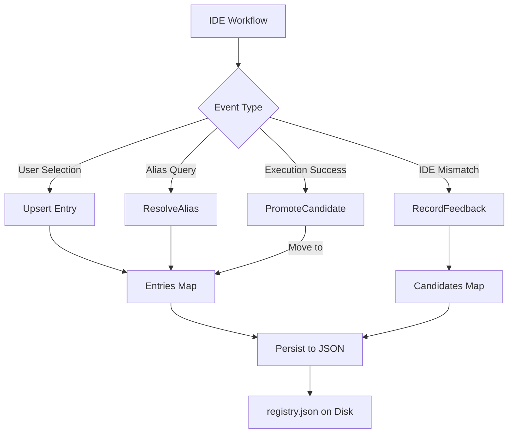

# Registry Module

The `registry` package implements **persistent workspace storage** and **feedback tracking**, enabling deterministic cross-session workspace selection and candidate promotion via IDE execution signals.

## 🎯 Objectives

The registry ensures:
- **Persistence**: Workspace selections survive IDE restarts
- **Determinism**: Same workspace alias always resolves to same root
- **Feedback Loop**: IDE suggestions drive future auto-selection (with execution signal)
- **Auditability**: Track metrics (feedback ingested, candidates promoted)
- **TTL/Cleanup**: Remove stale entries after configurable inactivity

### Key Behaviors:
1. **Upsert**: Confirm workspace selections (IDE clicked "use this root")
2. **Alias Resolution**: Look up workspace by friendly name
3. **Feedback Ingestion**: Store IDE-suggested paths as candidates
4. **Candidate Promotion**: Upgrade candidates to confirmed entries only after successful execution
5. **Metrics**: Count feedback events and promotions for analytics

---

## 📊 Data Flow



---

## 🏗️ Package Structure

*   **registry.go**: Main registry implementation with persistence, lookup, and feedback workflows
*   **registry_test.go**: Unit tests for I/O, cleanup, and promotion conditions

---

## 🔍 Key Types

### Entry (Confirmed Workspace)
```go
type Entry struct {
    SchemaVersion string    // Format version
    ID            string    // SHA1(root + branch + worktree)
    Root          string    // Filesystem path
    Name          string    // Friendly name (e.g., "my-project")
    Client        string    // IDE/client name (e.g., "windsurf")
    ConfirmedAt   time.Time // When IDE selected this root
    LastUsedAt    time.Time // Last access timestamp
}
```

### CandidateEntry (Suggested but Unconfirmed)
```go
type CandidateEntry struct {
    Root       string    // Suggested path
    Count      int       // Number of times IDE suggested it
    LastSeenAt time.Time // Time of last suggestion
    Reason     string    // Why IDE suggested (feedback reason)
}
```

### Metrics
```go
type Metrics struct {
    FeedbackIngested   int // Count of IDE feedback events
    CandidatesPromoted int // Count of successful promotions
}
```

---

## 🔄 Operations

### 1. Upsert (Confirm Selection)
```go
entry, err := registry.Upsert(
    "/home/user/project",    // root
    "my-project",            // friendly name
    "windsurf",              // client/IDE
)
// Stores confirmed entry, updates timestamps
```

### 2. Resolve Alias
```go
entries := registry.LookupByName("my-project")
if len(entries) > 0 {
    return entries[0].Root  // "/home/user/project"
}
```

### 3. Record Feedback
```go
err := registry.RecordFeedback(ctx, &contract.PathFeedback{
    SuggestedPath: "/other/project",
    Reason:        "IDE mismatch detected",
})
// Stores as unconfirmed candidate, increments count
```

### 4. Promote Candidate (Execution Success)
```go
err := registry.PromoteCandidate(
    ctx,
    "/other/project",  // root
    "windsurf",        // client
    true,              // execution_succeeded (required)
)
// Only if executionSucceeded=true:
//   - Move /other/project from candidates to confirmed entries
//   - Remove from candidates map
//   - Increment metrics.CandidatesPromoted
```

### 5. Cleanup (Remove Stale Entries)
```go
cutoff := time.Now().AddDate(0, -1, 0)  // 1 month ago
err := registry.Cleanup(cutoff)
// Removes entries where LastUsedAt < cutoff
```

---

## 💾 Storage Format

Registry is persisted as JSON with V2 schema:

```json
{
  "version": "v2",
  "entries": [
    {
      "schema_version": "v1",
      "id": "abc123...",
      "root": "/home/user/project",
      "name": "my-project",
      "client": "windsurf",
      "confirmed_at": "2025-02-18T10:30:00Z",
      "last_used_at": "2025-02-18T15:45:00Z"
    }
  ],
  "candidates": [
    {
      "root": "/other/project",
      "count": 3,
      "last_seen_at": "2025-02-18T14:20:00Z",
      "reason": "mismatch feedback"
    }
  ]
}
```

---

## 🚀 Usage Examples

### Setup Registry
```go
registry, err := registry.New("/home/user/.ragcode/registry.json")
if err != nil {
    log.Fatal(err)
}

// Optional: Configure audit sink for monitoring
registry.SetAuditSink(&customAuditSink{})
```

### Workflow: IDE Selection → Promotion
```go
ctx := context.Background()

// 1. User selects workspace in IDE
registry.Upsert("/home/user/project", "my-project", "windsurf")

// 2. IDE provides feedback on mismatch
registry.RecordFeedback(ctx, &contract.PathFeedback{
    SuggestedPath: "/home/user/actual-project",
    Reason:        "resolver mismatch",
})

// 3. User executes code successfully → IDE signals success
registry.PromoteCandidate(ctx, "/home/user/actual-project", "windsurf", true)

// 4. Next IDE session uses "actual-project" automatically
entries := registry.LookupByName("actual-project")
// Now available for alias resolution
```

### Metrics & Auditing
```go
metrics := registry.MetricsSnapshot()
println("Feedback Events:", metrics.FeedbackIngested)
println("Promotions:", metrics.CandidatesPromoted)
```

---

## ✅ Promotion Rules

Candidate is promoted **if and only if**:

| Condition | Status |
|-----------|--------|
| `execution_succeeded == true` | ✅ Required |
| `root` is non-empty | ✅ Required |
| Root has valid filesystem access | ✅ Validated |
| Candidate exists in pool | ✅ Required |

**If any condition fails**, promotion is silently skipped (no error).

---

## 🔗 Integration Points

- **ResolveWorkspaceRequest**: Includes feedback
- **Resolver**: Calls `RecordFeedback()` + `PromoteCandidate()`
- **Contract**: Provides `PathFeedback` type
- **Engine**: Manages registry lifecycle
