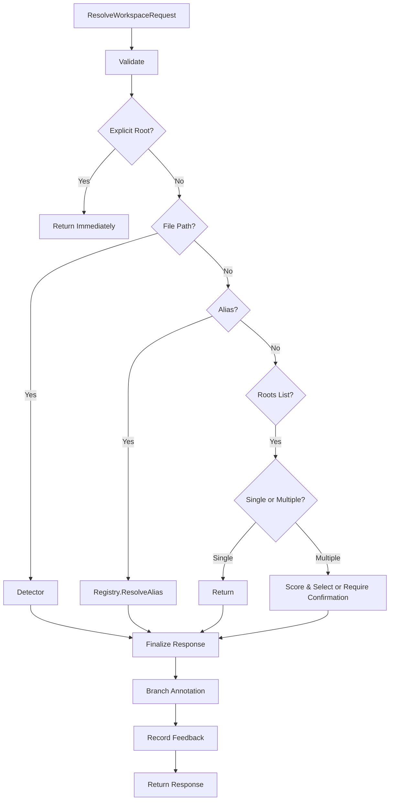

# Resolver Module

The `resolver` package implements the **deterministic decision cascade** that orchestrates workspace resolution through an ordered pipeline: explicit root → file detection → alias lookup → roots scoring.

## 🎯 Objectives

The resolver ensures:
- **Determinism**: Same input always produces same output
- **Transparency**: Every decision path is logged and reasoned
- **Idempotence**: Repeated calls with identical input return identical results
- **Ambiguity Handling**: Multiple candidates require explicit IDE confirmation (no silent fallback)

### Resolution Strategy:
1. Validate request
2. Try explicit `workspace_root` → return immediately if provided
3. Try `file_path` detection via detector
4. Try `workspace` alias via registry
5. Try `roots` list → pick best or require confirmation
6. Annotate response with branch/HEAD metadata
7. Record feedback and promote successful candidates

---

## 📊 Data Flow



---

## 🏗️ Package Structure

*   **resolver.go**: Main resolver implementation with decision cascade
*   **resolver_test.go**: Comprehensive unit tests for all decision paths

---

## 🔍 Key Types

### Dependencies
```go
type Dependencies struct {
    Detector        Detector        // File path detection
    Registry        Registry        // Alias & feedback storage
    RootValidator   RootValidator   // Security/boundary checks
    BranchAnnotator BranchAnnotator // Git metadata enrichment
    Logger          Logger          // Structured logging
}
```

### Decision Flow
```
1. ValidateRequest() ────── Syntax check
    ↓
2. handleWorkspaceRoot() ─── Explicit root (100% confidence)
    ↓
3. handleFilePath() ───────── Detector (95% confidence)
    ↓
4. handleWorkspaceAlias() ─── Registry (90% confidence)
    ↓
5. handleRoots() ──────────── List (75% confidence, or ambiguous)
    ↓
6. finalize() ────────────── Annotate branch + metadata
    ↓
7. Record feedback ────────── Ingestion + promotion
```

---

## 🚀 Resolution Examples

### Case 1: Explicit Root (Highest Priority)
```go
req := contract.ResolveWorkspaceRequest{
    WorkspaceRoot: "/home/user/project",
}
resp, _ := resolver.Resolve(ctx, req)
// Reason: EXPLICIT_WORKSPACE_ROOT
// Confidence: 1.0 (100%)
// UsedFallback: false
```

### Case 2: File Path Detection
```go
req := contract.ResolveWorkspaceRequest{
    FilePath: "/home/user/project/src/main.go",
}
resp, _ := resolver.Resolve(ctx, req)
// Reason: FILE_PATH
// Confidence: 0.95
// UsedFallback: false
```

### Case 3: Workspace Alias
```go
req := contract.ResolveWorkspaceRequest{
    Workspace: "my-project",
}
resp, _ := resolver.Resolve(ctx, req)
// Reason: WORKSPACE_ALIAS
// Confidence: 0.9 (90%) - registry is fallback source
// UsedFallback: true
```

### Case 4: Single Root
```go
req := contract.ResolveWorkspaceRequest{
    Roots: []string{"/home/user/project"},
}
resp, _ := resolver.Resolve(ctx, req)
// Reason: ROOTS_LIST
// Confidence: 0.8
// UsedFallback: true
```

### Case 5: Ambiguous Roots (Strict Mode)
```go
req := contract.ResolveWorkspaceRequest{
    Roots: []string{"/a", "/b"},
    StrictMode: true,
}
resp, err := resolver.Resolve(ctx, req)
// Error: ErrorAmbiguousWorkspace
// Message: "multiple roots provided; confirmation required"
// Response: nil (strict mode fails fast)
```

### Case 6: Ambiguous Roots (Fallback)
```go
req := contract.ResolveWorkspaceRequest{
    Roots: []string{"/x/y/z", "/a/b"},  // Same depth
}
resp, _ := resolver.Resolve(ctx, req)
// RequiresConfirmation: true
// Candidates: [/x/y/z, /a/b]
// Reason: CONFIRMATION_REQUIRED
```

---

## 🔄 Confidence & Fallback Logic

| Source | Confidence | IsUsedFallback |
|--------|-----------|----------------|
| `workspace_root` | 1.0 | false |
| `file_path` | 0.95 | false |
| `workspace` alias | 0.9 | **true** |
| `roots` list | 0.75-0.8 | **true** |
| Confirmation required | N/A | N/A |

**Fallback** means the resolver had to resort to less-preferred sources (no explicit root or file path available).

---

## 🎯 Feedback & Promotion

### Recording Feedback
```go
feedback := &contract.PathFeedback{
    Status:        "mismatch",
    SuggestedPath: "/actual/project",
    Reason:        "IDE resolved differently",
}
resolver.recordFeedback(ctx, feedback)
```

### Promotion (Only After Execution Success)
```go
feedback := &contract.PathFeedback{
    SuggestedPath:      "/actual/project",
    ExecutionSucceeded: true, // ← Required signal
}
resolver.promoteFeedback(ctx, req, resp)
// After this: /actual/project is added to registry as confirmed entry
```

**Key Rule**: Candidates are promoted **only** when:
1. IDE provided `suggested_path`
2. IDE executed code successfully (`execution_succeeded=true`)
3. Suggested path matches resolved root

---

## ✅ Error Handling

| Error Code | Reason | Recovery |
|-----------|--------|----------|
| `NO_CONTEXT` | No valid input source | Provide `workspace_root`, `file_path`, alias, or `roots` |
| `INVALID_PATH` | File doesn't exist or non-canonical | Verify path is absolute and valid |
| `OUTSIDE_ALLOWED_ROOTS` | Resolved root violates boundary | Use allowed roots restriction |
| `AMBIGUOUS_WORKSPACE` | Multiple candidates without confirmation | Provide `StrictMode=false` or single root |

---

## 🔗 Integration Points

- **Contract**: Consumes `ResolveWorkspaceRequest`, returns `ResolveWorkspaceResponse`
- **Detector**: Calls for file path detection
- **Registry**: Resolves aliases + records feedback/promotions
- **BranchAnnotator**: Enriches response with git metadata
- **Engine**: High-level orchestrator
