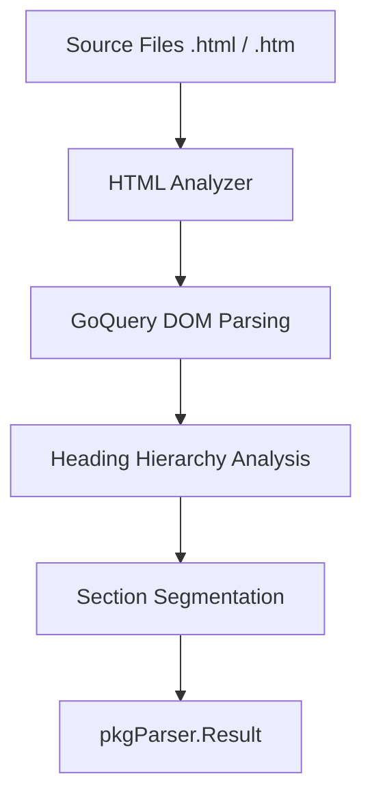

# HTML Parser

The `html` package provides an analyzer for **HTML** documents, specializing in content segmentation into logical sections based on the header hierarchy.

## 🎯 Objectives

Unlike a programming language parser, the HTML analyzer focuses on the semantic structure of the document to facilitate the indexing of relevant text chunks.

### Extracted Symbols:
1.  **Page Title**: Extracted from the `<title>` tag.
2.  **Sections (Headings)**: Any text residing under `h1` - `h6` tags.
3.  **Code Blocks**: Identifies and groups `<pre>` and `<code>` tags found within sections.
4.  **HTML Attributes**: Captures `id` and `class` attributes for precise referencing.

---

## 📊 Data Flow



---

## 🏗️ Package Structure

*   `types.go`: Defines `CodeChunk` for HTML segments.
*   `analyzer.go`: Implements DOM navigation and segmentation logic.
*   `analyzer_test.go`: Tests accurate extraction of titles and content blocks.

---

## 🔍 Extraction Example

### HTML Source Code:
```html
<title>API Guide</title>
<h1 id="intro">Introduction</h1>
<p>This is a guide.</p>
<pre><code>curl -X GET ...</code></pre>
```

### Result (Symbol Metadata):
| Field | Value |
|------|---------|
| `Name` | `"Introduction"` |
| `Type` | `"type"` (Section) |
| `Metadata.heading_level` | `1` |
| `Metadata.html_id` | `"intro"` |
| `Docstring` | `"This is a guide."` |
| `Content` | `Full content + code block` |

---

## 💻 Usage

```go
import (
    "context"
    "github.com/doITmagic/rag-code-mcp/v2/pkg/parser"
    _ "github.com/doITmagic/rag-code-mcp/v2/pkg/parser/html"
)

func main() {
    analyzer := parser.GetByName("html")
    result, err := analyzer.Analyze(context.Background(), "./docs")
    // ... process segments
}
```

---

## 📋 Technical Notes

*   **Smart Segmentation**: A section includes all content from a header until the next header of the same or higher level.
*   **Normalization**: Multiple whitespaces and empty lines are cleaned to optimize embeddings.
