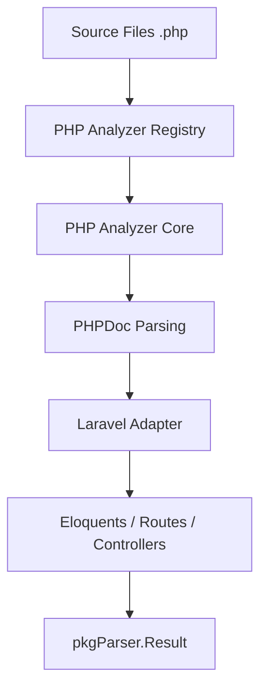

# PHP Parser

The `php` package implements a robust analyzer for the **PHP** language, providing extensive support for modern versions (8.0+) and native integration with the **Laravel** framework.

## 🎯 Objectives

The PHP analyzer extracts complex code structures, emphasizing object relationships and framework-specific metadata.

### Extracted Symbols:
1.  **Classes**: Class definitions, namespaces, inheritances, and implemented interfaces.
2.  **Methods**: Visibility, return types, parameters, and docstrings (PHPDoc).
3.  **Interfaces & Traits**: Full support for PHP composition structures.
4.  **Laravel Specialization**: Automatically detects Eloquent models, relationships (`hasMany`, `belongsTo`), controllers, and routes.
5.  **Functions & Constants**: Global or class-level symbols.

---

## 📊 Data Flow



---

## 🏗️ Package Structure

*   `types.go`: Local data structures (e.g., `ClassInfo`, `MethodInfo`, `ReturnInfo`).
*   `analyzer.go`: Main conversion and scanning logic.
*   `php_analyzer.go`: Implementation of the `parser.Analyzer` interface.
*   `phpdoc.go`: Specialized parser for PHPDoc comments.
*   `laravel/`: Dedicated sub-package for Laravel-specific analysis (Eloquent, Relationships, Diagrams).

---

## 🔍 Extraction Example

### PHP Source Code (Laravel Model):
```php
namespace App\Models;

class User extends Model {
    /** @return HasMany */
    public function orders() {
        return $this->hasMany(Order::class);
    }
}
```

### Result (Symbol Metadata):
| Field | Value |
|------|---------|
| `Name` | `"User"` |
| `Type` | `"class"` |
| `Metadata.namespace` | `"App\Models"` |
| `Metadata.is_eloquent` | `true` |
| `Metadata.relations` | `[{"name": "orders", "type": "hasMany", "related": "Order"}]` |

---

## 💻 Usage

```go
import (
    "context"
    "github.com/doITmagic/rag-code-mcp/v2/pkg/parser"
    _ "github.com/doITmagic/rag-code-mcp/v2/pkg/parser/php"
)

func main() {
    analyzer := parser.GetByName("php")
    result, err := analyzer.Analyze(context.Background(), "./app")
    // ... process result.Symbols
}
```

---

## 📋 Metadata and Components

| Component | Description |
|------------|-----------|
| **PHPDoc** | Extracts complex types from comments (e.g., `Collection<User>`). |
| **Laravel** | Automatically identifies routes and maps them to controller methods. |
| **Visibility** | Captures whether a method is `public`, `protected`, or `private`. |
