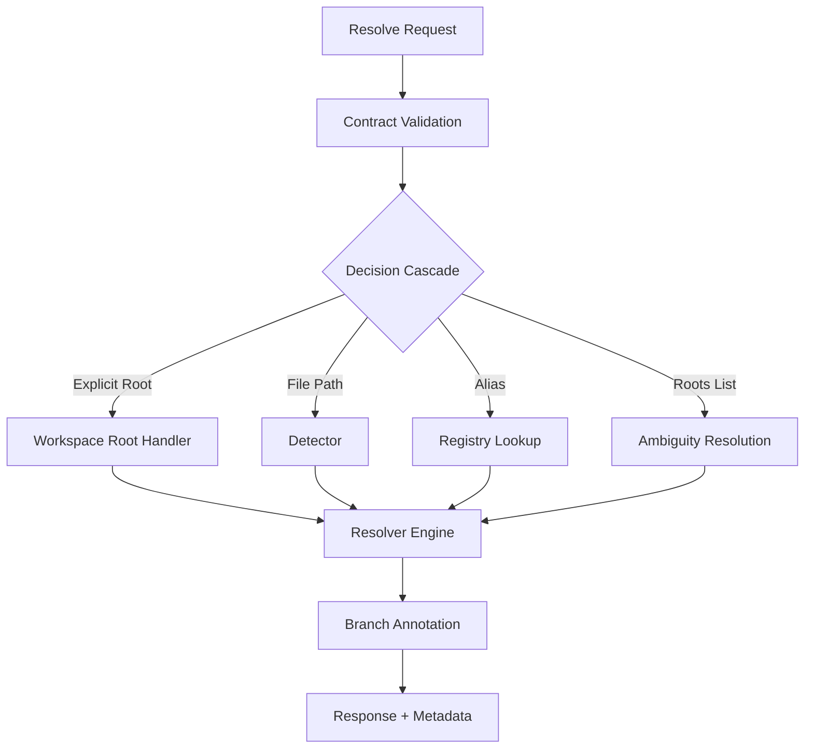

# RagCode Workspace Detection System (V2)

The `workspace` package is the core engine for **deterministic workspace detection and resolution**. It provides a unified interface for detecting, registering, and managing workspace contexts across multiple IDEs and development environments.

## 🏗️ Architecture Overview

The system is built on a modular, layered architecture where workspace detection flows through a deterministic cascade: explicit roots → file-based detection → registry aliases → ambiguity resolution.



## 🛠️ Core Interfaces

### Contract (`contract/`)
Defines canonical request/response types and derivation functions for workspace IDs and context keys.

### Detector (`detector/`)
Implements marker-based root detection using upward directory traversal and security validation.

### Resolver (`resolver/`)
Orchestrates the deterministic decision cascade that selects a single workspace or returns ambiguous candidates.

### Registry (`registry/`)
Persists confirmed workspace selections and tracks candidate feedback for future promotion.

### BranchState (`branchstate/`)
Enriches responses with git metadata (branch, HEAD, worktree) and detects invalidation conditions.

### Tests (`tests/`)
End-to-end integration tests covering all decision paths, branch transitions, and feedback workflows.

## 📂 Module Overview

| Module | Directory | Purpose | Status |
|--------|-----------|---------|--------|
| **Contract** | [`/contract`](./contract/README.md) | Request/response types, validation, ID derivation. | ✅ Production |
| **Detector** | [`/detector`](./detector/README.md) | Marker-based root detection with security checks. | ✅ Production |
| **Resolver** | [`/resolver`](./resolver/README.md) | Deterministic decision cascade engine. | ✅ Production |
| **Registry** | [`/registry`](./registry/README.md) | Persistent workspace storage & feedback tracking. | ✅ Production |
| **BranchState** | [`/branchstate`](./branchstate/README.md) | Git metadata enrichment & invalidation detection. | ✅ Production |
| **Tests** | [`/tests`](./tests/README.md) | Integration tests & scenario validation. | ✅ Production |

## 🔄 Resolution Flow

```
IDE Request
    ↓
Contract.ValidateRequest()
    ↓
Resolver.Resolve()
    ├─→ workspace_root provided? → Return immediately
    ├─→ file_path provided? → Detector.DetectFromFilePath()
    ├─→ workspace alias? → Registry.ResolveAlias()
    └─→ roots list? → SelectBestRoot() or require confirmation
    ↓
BranchAnnotator.Annotate()
    ↓
Response + Metadata (confidence, source, context key)
    ↓
Registry.RecordFeedback() + PromoteCandidate() on execution success
```

## 🎯 Key Concepts

### WorkspaceID
Content-based identifier derived from `(root, branch, worktree)`. Used to isolate cache across branches.

### PathContextKey
Unique context key derived from `(root, branch, HEAD, worktree)`. Used to detect invalidation conditions.

### MismatchRisk
Confidence decay factor: `low` (no risk) → `medium` (branch changed) → `high` (fallback-only).

### Candidate Promotion
Suggested paths from IDE feedback are only promoted to confirmed entries after successful execution.

## 🚀 Getting Started

```go
package main

import (
    "context"
    "github.com/doITmagic/rag-code-mcp/v2/pkg/workspace/contract"
    "github.com/doITmagic/rag-code-mcp/v2/pkg/workspace/resolver"
    "github.com/doITmagic/rag-code-mcp/v2/pkg/workspace/detector"
    "github.com/doITmagic/rag-code-mcp/v2/pkg/workspace/registry"
)

func main() {
    ctx := context.Background()
    
    // Setup dependencies
    det := detector.New(detector.DefaultOptions())
    reg, _ := registry.New("/tmp/registry.json")
    
    // Create resolver
    res := resolver.New(resolver.Dependencies{
        Detector: det,
        Registry: reg,
    })
    
    // Resolve workspace
    req := contract.ResolveWorkspaceRequest{
        FilePath: "/home/user/project/main.go",
    }
    
    resp, err := res.Resolve(ctx, req)
    if err != nil {
        panic(err)
    }
    
    println("Resolved:", resp.ResolvedRoot)
    println("ID:", resp.WorkspaceID)
}
```

## 📚 Further Reading

- [Contract Reference](./contract/README.md) – Request/response types
- [Detector Guide](./detector/README.md) – Marker-based detection
- [Resolver Guide](./resolver/README.md) – Decision cascade logic
- [Registry Guide](./registry/README.md) – Persistence & feedback
- [BranchState Guide](./branchstate/README.md) – Git metadata
- [Test Scenarios](./tests/README.md) – Integration tests
